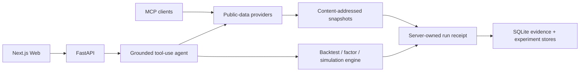

<div align="center">

# QuantSieve

**Evidence-first quantitative research — reproducible runs, explicit assumptions, and honest failure states.**

[简体中文](docs/README_ZH.md) · [Quick start](#quick-start) · [How trust is enforced](#how-trust-is-enforced) · [Roadmap](docs/ROADMAP.md) · [Contributing](docs/CONTRIBUTING.md)

[](https://github.com/RRXXZZYY/QuantSieve/actions/workflows/ci.yml)
[](https://github.com/RRXXZZYY/QuantSieve/actions/workflows/security.yml)
[](https://github.com/RRXXZZYY/QuantSieve/releases/latest)
[](LICENSE)


</div>

[](https://github.com/RRXXZZYY/QuantSieve)

<p align="center">
  <a href="https://github.com/RRXXZZYY/QuantSieve/releases/download/v0.1.1/quantsieve-demo.mp4"><strong>▶ Watch the 55-second product tour</strong></a><br>
  <sub>Recorded interface · fixture data · no audio</sub>
</p>

Most research tools make it easy to produce a chart. QuantSieve focuses on the harder question: **can you trace the result back to the data, timing, assumptions, costs, and execution model that produced it?**

QuantSieve combines grounded market research, backtests, factor diagnostics, portfolio experiments, event simulation, and AI explanations in one self-hosted workspace. Models may reason and narrate; tools own every number. When evidence is insufficient, the system is designed to say so.

> [!IMPORTANT]
> QuantSieve is research and simulation software for one trusted operator. It is not an investment adviser, custody system, multi-tenant SaaS, or live-trading terminal. It cannot connect an account or route a real order.

## Why QuantSieve

| The usual shortcut | QuantSieve's default |
| --- | --- |
| A polished chart with an unclear origin | Content-addressed data snapshots and citations |
| Parameters hidden behind UI state | Server-owned run receipts with assumptions and costs |
| Same-period tuning and evaluation | Separate development and final holdout periods |
| Convenient same-bar fills | Next-bar execution semantics with explicit fees and slippage |
| Forced confidence | A clear insufficient-evidence result |

The recorded interface below illustrates the key-free demo workflow. Its values are fixture data, not current quotes, live results, or a performance claim.


## Quick start

You need Docker Desktop (or a compatible Docker Engine) and Docker Compose. A first cold build downloads base images and dependencies and will usually take several minutes.

```bash
git clone https://github.com/RRXXZZYY/QuantSieve.git
cd QuantSieve
cp .env.example .env
docker compose up --build
```

PowerShell:

```powershell
Copy-Item .env.example .env
docker compose up --build
```

Then open [http://localhost:3000](http://localhost:3000). API documentation is at [http://localhost:8000/docs](http://localhost:8000/docs), and the health endpoint should return `{"status":"ok", ...}`:

```bash
curl http://localhost:8000/health
```

Compose binds both services to `127.0.0.1` by default. Before refreshing SEC 13F data, replace the example User-Agent in `.env` with a reachable application name and contact email.

## What works today

- **Grounded research:** multi-market search and explanations where numerical claims come from tool output with citations.
- **Backtests and discovery:** 18 active/passive templates, costs, holdouts, baseline comparisons, and stability diagnostics.
- **Factor research:** momentum, reversal, low-volatility, and volume-surprise diagnostics on finalized daily bars with explicit PIT limits.
- **Portfolio experiments:** initial equal weight, periodic equal weight, and inverse-volatility allocation using prior-day decisions and next shared-day open rebalancing.
- **Paper and event simulation:** persistent simulated accounts, orders, risk decisions, double-entry ledger, and deterministic event replay — with no live-order channel.
- **MCP server:** symbol search, historical bars, quotes, statements, A-share fund flow, and company news, each returning `citations`.

The [roadmap](docs/ROADMAP.md) distinguishes shipped behavior from planned work. Time and execution semantics are specified in the [factor research contract](docs/FACTOR_RESEARCH.md) and [event simulation contract](docs/EVENT_SIMULATION.md).

## How trust is enforced



Key integrity rules include:

- indicator warm-up is excluded from reported returns;
- decisions and fills follow explicit bar-time semantics;
- fees, slippage, baselines, and holdouts remain visible;
- browser-supplied summaries cannot overwrite server-computed results;
- provider work that outlives an HTTP timeout keeps its global capacity lease until the underlying task actually completes;
- key-free demos are labeled recorded snapshots, never presented as live market data.

## Local development

Requires Python 3.12+, Node.js 24+, and pnpm 11.9.0:

```bash
python -m venv .venv
# Windows: .venv\Scripts\activate
# macOS/Linux: source .venv/bin/activate
python -m pip install -r requirements-dev.txt

corepack enable
pnpm install --frozen-lockfile

quantsieve-api
# in another terminal
pnpm dev
```

Run the main quality gates:

```bash
ruff check .
mypy
pytest
pnpm lint
pnpm typecheck
pnpm test
pnpm build
```

CI also builds the Python distributions, validates package metadata, scans the public-release boundary, and performs a Compose build and health smoke test. Tests marked `live` call third-party services and are excluded from ordinary CI.

## MCP from source

`quantsieve-mcp` is not published on PyPI. Install it from this repository in an isolated environment:

```bash
python -m pip install "./packages/providers[all]" ./packages/mcp
quantsieve-mcp
```

```json
{
  "mcpServers": {
    "quantsieve": {
      "command": "quantsieve-mcp"
    }
  }
}
```

## Safety boundaries

- The REST API has no application authentication, authorization, or tenant isolation. Keep it on localhost or a controlled private network; do not expose it directly to the internet.
- The custom-strategy runner reduces accidental local harm with an AST allowlist, process isolation, timeouts, and platform resource limits. It is not a hostile-code or multi-tenant sandbox.
- Public data can be delayed, missing, revised, or unavailable. Aggregated headlines are leads, not verified full reports.
- The factor page uses a fixed ex-post user-selected basket rather than reconstructed historical constituents. Current IC/IR output has no HAC or embargo correction.
- Simulation does not support real accounts, real orders, shorting, leverage, margin, or full venue microstructure.
- Historical results do not predict future performance. Nothing in this repository is investment advice.

Read [SECURITY.md](SECURITY.md) and the [threat model](docs/THREAT_MODEL.md) for the full deployment boundary and private vulnerability-reporting path.

## Contributing

Useful bug reports, reproducibility checks, documentation fixes, provider adapters, and focused pull requests are welcome. Start with the [contributing guide](docs/CONTRIBUTING.md), [good first issues](https://github.com/RRXXZZYY/QuantSieve/labels/good%20first%20issue), or a [feature discussion](https://github.com/RRXXZZYY/QuantSieve/discussions).

If this evidence-first approach is useful, star the repository to follow its development — and challenge any claim that is not backed by code, tests, or a source.

QuantSieve is available under the [MIT License](LICENSE). Third-party components and licenses are listed in [THIRD_PARTY_NOTICES.md](THIRD_PARTY_NOTICES.md). Public snapshots are generated through an allowlisted, history-scanning release gate documented in [release integrity](docs/RELEASE_INTEGRITY.md).
