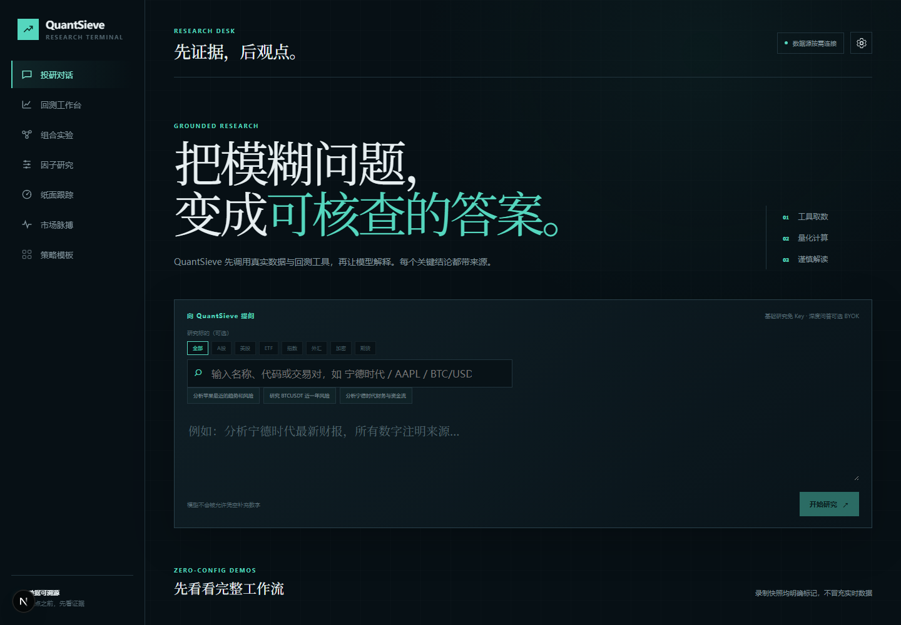
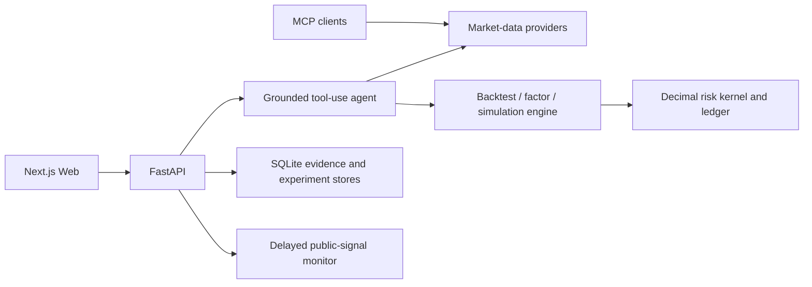

<div align="center">

# 🧭 QuantSieve

**Evidence first, opinions second. A self-hosted quantitative research workspace that refuses polished but unsupported results.**

[简体中文](../README.md) · [Quick start](#-quick-start) · [Roadmap](ROADMAP.md) · [Security](../SECURITY.md) · [Contributing](CONTRIBUTING.md)

[](../LICENSE)


</div>

---

QuantSieve puts market data, factor research, backtests, portfolio experiments, event simulation, and AI explanations on one evidence chain. Models reason and narrate; tools supply the numbers. Results bind sources, timing, parameters, costs, and execution semantics, and fail closed when evidence is insufficient.

The current release is research software for one trusted operator. It is not an investment adviser, custody system, or live-trading terminal.

> The image below is a recorded demo. Its market data and metrics illustrate the workflow only; they are not current quotes, live results, or a performance promise.



## What makes it different

- **Traceable evidence:** citations, normalized data snapshots, parameters, and execution rules are bound into server-owned run receipts.
- **Honest evaluation:** warm-up data is isolated, fills occur on the next bar, development and final holdout periods stay separate, and simple baselines remain visible.
- **Explicit safety boundaries:** paper tracking, the durable simulation OMS, and the event simulator cannot send real orders; the default deployment binds to localhost.

| Workspace | What it does | Main integrity constraint |
| --- | --- | --- |
| Grounded research | Search and explain stocks, ETFs, indices, FX, crypto, and futures | Every numerical claim must originate in tool output |
| Backtests and discovery | 18 active/passive templates, costs, holdouts, and stability checks | No look-ahead; returns “no actionable strategy” when gates fail |
| Factor research | Momentum, reversal, low-volatility, and volume-surprise diagnostics | Finalized daily bars, exact UTC alignment, PIT and overlap limits disclosed |
| Portfolio experiments | Initial equal weight, periodic equal weight, and inverse volatility | Prior-day decisions, next shared-day open rebalancing |
| Paper and event simulation | Persistent simulated accounts, orders, risk decisions, and double-entry ledger | Long-only; no account credentials or real-order channel |
| Market pulse | Official RSS, SEC, OFAC, HKMA, and delayed news leads | Aggregated headlines never masquerade as verified full reports |

See the [roadmap](ROADMAP.md) for the full capability boundary, the [factor research contract](FACTOR_RESEARCH.md) for time semantics, and the [event simulation contract](EVENT_SIMULATION.md) for execution semantics.

## 🚀 Quick start

You need Docker Desktop (or a compatible Docker Engine) and Docker Compose. A first cold build downloads base images and dependencies and will usually take several minutes.

```bash
git clone https://github.com/RRXXZZYY/QuantSieve.git
cd QuantSieve
cp .env.example .env
docker compose up --build
```

PowerShell:

```powershell
Copy-Item .env.example .env
docker compose up --build
```

Open [http://localhost:3000](http://localhost:3000). API documentation is at [http://localhost:8000/docs](http://localhost:8000/docs). The health endpoint should return `{"status":"ok", ...}`:

```bash
curl http://localhost:8000/health
```

Compose binds both services to `127.0.0.1` by default. Before refreshing SEC 13F data, replace the example User-Agent in `.env` with a reachable application name and contact email:

```env
QUANTSIEVE_SEC_USER_AGENT=MyResearchApp me@example.com
```

Portfolio forward-observation schedulers are disabled by default. Enable them only after checking clocks, network isolation, and finalized-bar evidence; they still cannot connect an account or execute a real order.

## Local development

Requires Python 3.12+, Node.js 24+, and pnpm 11.9.0:

```bash
python -m venv .venv
# Windows: .venv\Scripts\activate
# macOS/Linux: source .venv/bin/activate
python -m pip install -r requirements-dev.txt

corepack enable
pnpm install --frozen-lockfile

quantsieve-api
# in another terminal
pnpm dev
```

## MCP (install from this repository)

`quantsieve-mcp` is not published on PyPI yet. After cloning the repository, install it from local source in an isolated environment:

```bash
python -m pip install "./packages/providers[all]" ./packages/mcp
quantsieve-mcp
```

Example client configuration:

```json
{
  "mcpServers": {
    "quantsieve": {
      "command": "quantsieve-mcp"
    }
  }
}
```

Tools cover symbol search, historical bars, quotes, financial statements, A-share fund flow, and company news. Every result includes `citations`.

## Architecture



```text
apps/web/            Next.js, TypeScript, ECharts
apps/api/            FastAPI, BYOK agent, REST/SSE
packages/providers/  Multi-market public data, citations, SQLite cache
packages/monitor/    Delayed public-signal feed and event store
packages/engine/     Backtests, factors, portfolios, risk, event simulation
packages/mcp/        Standalone MCP server
```

## Quality gates

```bash
ruff check .
mypy
pytest
pnpm lint
pnpm typecheck
pnpm test
pnpm build
```

CI also builds the Python distributions, checks package metadata and public-release boundaries, and runs a Compose build and health smoke test. Tests marked `live` call third-party services and are excluded from ordinary CI.

Public versions are generated from a clean commit as a new-history, allowlisted snapshot. The gate scans the release tree, complete Git history, exact inventory, secret-like patterns, machine paths, and pinned binary digests. See [release integrity](RELEASE_INTEGRITY.md).

## Safety and limitations

- The REST API has no application authentication, authorization, or tenant isolation. Keep it on localhost or a controlled private network; do not expose it directly to the internet.
- The custom-strategy runner uses an AST allowlist, a separate process, timeouts, and platform resource limits to reduce accidental local harm. It is not a hostile-code or multi-tenant sandbox.
- Public data can be delayed, missing, revised, or unavailable. Aggregated headlines are leads, not verified full reports.
- The factor page uses a fixed ex-post user-selected basket rather than reconstructed historical constituents. Current IC/IR output has no HAC or embargo correction.
- Simulation does not support real accounts, real orders, shorting, leverage, margin, or full venue microstructure.
- This project is for research and education only. It is not investment advice, and historical results do not predict future performance.

Read [SECURITY.md](../SECURITY.md) and the [threat model](THREAT_MODEL.md) for the full deployment boundary and vulnerability-reporting process.

## Contributing and license

Issues and pull requests are welcome. Read the [contributing guide](CONTRIBUTING.md) and [code of conduct](../CODE_OF_CONDUCT.md) before participating.

QuantSieve is available under the [MIT License](../LICENSE). Third-party components and licenses are listed in [THIRD_PARTY_NOTICES.md](../THIRD_PARTY_NOTICES.md).
