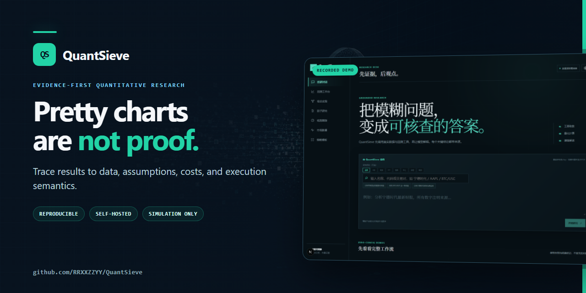
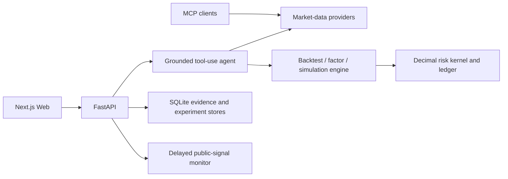

<div align="center">

# 🧭 QuantSieve

**先证据，后观点。一个自托管、可复现、明确拒绝“漂亮但不可信”结果的量化研究工作台。**

[English](../README.md) · [快速启动](#-快速启动) · [产品边界](ROADMAP.md) · [安全](../SECURITY.md) · [贡献](CONTRIBUTING.md)

[](../LICENSE)


</div>

---

[](https://github.com/RRXXZZYY/QuantSieve)

<p align="center">
  <a href="https://github.com/RRXXZZYY/QuantSieve/releases/download/v0.1.1/quantsieve-demo.mp4"><strong>▶ 观看 55 秒产品演示</strong></a><br>
  <sub>录制界面 · 固定样例数据 · 无音轨</sub>
</p>

QuantSieve 把行情、因子、回测、组合实验、事件模拟和 AI 解释放在同一个证据链中：模型负责推理与叙述，数字由工具返回；结果绑定来源、时间、参数、成本和执行语义，证据不足时失败关闭。

当前版本是面向单个可信操作者的研究软件，不是投顾产品、托管系统或实盘交易终端。

> 下图是录制演示。界面中的行情与指标仅用于展示工作流，不代表当前市场数据、实盘结果或收益承诺。


## 核心差异

- **证据可追溯**：行情、引用、数据快照、参数和执行模型进入同一运行回执；浏览器不能改写服务端结果。
- **评估不作弊**：指标预热与收益区间隔离，下一根 K 线开盘成交，开发集与最终留出期分开，并始终展示简单基准。
- **安全边界说清楚**：纸面跟踪、连续模拟 OMS 和事件模拟器都不能发送真实订单；默认服务仅绑定 localhost。

| 工作区 | 能做什么 | 可信性约束 |
| --- | --- | --- |
| 对话式投研 | 跨股票、ETF、指数、外汇、加密与期货检索和解释 | 数字必须来自工具结果并附来源 |
| 回测与策略发现 | 18 个主动/被动模板、成本、留出期与稳健性诊断 | 无未来函数；不合格时明确返回“无可行动策略” |
| 因子研究 | 动量、反转、低波动和量能异常的横截面诊断 | 完结日线、精确 UTC 对齐、披露重叠标签与 PIT 限制 |
| 组合实验 | 起点等权、定期等权、逆波动配置 | 前一日数据决策，下一共同交易日开盘再平衡 |
| 纸面与事件模拟 | 持久化模拟账户、订单、风险核验、复式账本 | long-only、无真实账户、无真实订单通道 |
| 市场脉搏 | 官方 RSS、SEC、OFAC、HKMA 与延迟新闻线索 | 聚合标题不冒充已核实全文 |

更完整的能力与未完成项见[路线图](ROADMAP.md)，因子与事件时间语义分别见[因子研究合同](FACTOR_RESEARCH.md)和[事件模拟合同](EVENT_SIMULATION.md)。

## 🚀 快速启动

需要 Docker Desktop（或兼容的 Docker Engine）与 Docker Compose。首次冷构建需要下载基础镜像和依赖，通常会花费数分钟。

```bash
git clone https://github.com/RRXXZZYY/QuantSieve.git
cd QuantSieve
cp .env.example .env
docker compose up --build
```

PowerShell 中复制环境文件：

```powershell
Copy-Item .env.example .env
docker compose up --build
```

启动后打开 [http://localhost:3000](http://localhost:3000)，API 文档位于 [http://localhost:8000/docs](http://localhost:8000/docs)。健康检查应返回 `{"status":"ok", ...}`：

```bash
curl http://localhost:8000/health
```

默认 Compose 只把 Web 和 API 绑定到 `127.0.0.1`。刷新 SEC 13F 前，请把 `.env` 中的示例 User-Agent 换成可联系的项目名与邮箱：

```env
QUANTSIEVE_SEC_USER_AGENT=MyResearchApp me@example.com
```

组合前向观察调度器默认关闭；只有完成时钟、网络隔离和完结 K 线核验后才应显式开启。它仍只生成模型化观察，不连接账户或执行真实交易。

## 本地开发

需要 Python 3.12+、Node.js 24+ 和 pnpm 11.9.0：

```bash
python -m venv .venv
# Windows: .venv\Scripts\activate
# macOS/Linux: source .venv/bin/activate
python -m pip install -r requirements-dev.txt

corepack enable
pnpm install --frozen-lockfile

quantsieve-api
# 另开终端
pnpm dev
```

## MCP（从仓库安装）

`quantsieve-mcp` 尚未发布到 PyPI。克隆本仓库后，可在独立虚拟环境中从本地源码安装：

```bash
python -m pip install "./packages/providers[all]" ./packages/mcp
quantsieve-mcp
```

MCP 客户端配置：

```json
{
  "mcpServers": {
    "quantsieve": {
      "command": "quantsieve-mcp"
    }
  }
}
```

可用工具包括名称/代码搜索、历史行情、最新报价、财报、A 股资金流和公司新闻；每个结果都包含 `citations`。

## 架构



```text
apps/web/            Next.js、TypeScript、ECharts
apps/api/            FastAPI、BYOK Agent、REST/SSE
packages/providers/  多市场公开数据、引用与 SQLite 缓存
packages/monitor/    延迟信息流与事件存储
packages/engine/     回测、因子、组合、风险和事件模拟
packages/mcp/        独立 MCP Server
```

## 质量门

```bash
ruff check .
mypy
pytest
pnpm lint
pnpm typecheck
pnpm test
pnpm build
```

CI 还会构建 Python 分发包、验证 README/元数据、检查公开发布边界，并对 Compose 主路径执行构建与健康冒烟。真实第三方接口测试标记为 `live`，普通 CI 不依赖外部行情波动。

公开版本由白名单工具从干净提交生成新历史快照，并检查待发布树、完整 Git 历史、文件清单、敏感形态、机器路径和二进制摘要。流程见[发布完整性说明](RELEASE_INTEGRITY.md)。

## 安全与限制

- 默认 REST 接口没有应用层认证、授权或多租户隔离，只能部署在 localhost 或受控私网，不能直接暴露到公网。
- 自定义策略执行器使用 AST 白名单、独立进程、超时和平台资源限制来降低本地误操作风险；它不是敌对代码或多租户安全边界。
- 公共数据可能延迟、缺失、修订或失效；聚合新闻只是线索，必须打开原始来源复核。
- 因子页使用用户事后选择的固定标的篮子，不是历史指数成分重建；当前 IC/IR 未做 HAC 或 embargo 修正。
- 模拟能力不支持真实账户、真实订单、做空、杠杆、保证金或完整交易场所微观结构。
- 本项目仅用于研究与教育，不构成投资建议；历史回测不代表未来表现。

完整部署边界、漏洞报告方式和已知限制见 [SECURITY.md](../SECURITY.md) 与[威胁模型](THREAT_MODEL.md)。

## 贡献与许可

欢迎提交 Issue 和 Pull Request。开始前请阅读[贡献指南](CONTRIBUTING.md)与[行为准则](../CODE_OF_CONDUCT.md)。

QuantSieve 采用 [MIT License](../LICENSE)。第三方组件与许可证见 [THIRD_PARTY_NOTICES.md](../THIRD_PARTY_NOTICES.md)。
